# Projeto: Análise Exploratória de Dados

## 0. Proposta

Este projeto prepara uma tarefa de **regressão**. O objetivo é prever
`median_earnings_4yr_usd`: a renda anual mediana de concluintes, medida 4 anos
depois da conclusão do curso. Cada granularidade observada na base é de um **programa**: combinação de uma instituição, um curso (código CIP) e um nível de
credencial.

- **Dataset:** [College Majors 2026: Earnings, Debt, Jobs, AI](https://www.kaggle.com/datasets/kylefengkfeng209/college-majors-2026-earnings-debt-jobs-ai), do Kaggle.
- **Tamanho:** 227.980 linhas × 72 colunas.
- **Origem:** integração pública de College Scorecard, IPEDS, NCES CIP–SOC,
  BLS e O\*NET. A semântica dos dados de renda segue a
  [documentação técnica do College Scorecard](https://collegescorecard.ed.gov/files/FieldOfStudyDataDocumentation.pdf)
  e a [atualização oficial de 2026](https://fsapartners.ed.gov/fsa-print/publication/1006843),
  que define a medição quatro anos após a graduação.
- **Motivação:** entender quanto o curso, a instituição, a ocupação associada e a exposição a tecnologias de IA ajudam a explicar o resultado financeiro do ex-aluno.
- **Primeiro risco:** o alvo não está disponível para todo mundo. **169.868 linhas (74,51%)** não têm `median_earnings_4yr_usd`, principalmente porque o governo americano suprime esse número quando a turma é pequena demais (dado uma regra de privacidade).

O escopo desta entrega termina no pré-processamento. Ou seja, **nenhum modelo foi
treinado**.

## 1. Inspeção inicial

### A. Dicionário de dados

A coluna `program_id` representa o id da tabela: tem **227.980 valores únicos**, sem
nenhum ausente. A tabela abaixo cobre as **72 colunas** do arquivo: 33
features do modelo, o alvo, `opeid6` (usado só para separar treino/teste) e
37 colunas excluídas como preditoras. Para cada uma, registra-se a fonte, papel,
tipo semântico, unidade, significado e decisão de uso.

Algumas descrições são inferidas a partir do nome da coluna e da fonte
(College Scorecard, BLS, O\*NET), pois o Kaggle não distribui um codebook
oficial completo.

--8<-- "docs/projects/eda/tables/data_dictionary.md"

### B. Qualidade

Não há linhas totalmente duplicadas nem `program_id` repetido: **a chave é confiável**.

Já quanto a ausência de dados, essa é grande e **não é aleatória**: os campos
de renda e dívida vêm acompanhados de flags como `earnings_4yr_status =
privacy_suppressed`, ou seja, faltam por uma regra conhecida (turma
pequena), não por acaso. As colunas com mais buracos:

| Coluna | Ausentes | % |
|---|---:|---:|
| `pct_working_in_state_5yr` | 188.983 | 82,90 |
| `count_working_in_state_5yr` | 188.983 | 82,90 |
| `earnings_trajectory_category` | 188.859 | 82,84 |
| `earnings_growth_pct_1yr_to_5yr` | 188.859 | 82,84 |
| `payment_to_income_pct_1yr` | 184.672 | 81,00 |
| `debt_to_earnings_1yr` | 184.672 | 81,00 |
| `debt_to_earnings_4yr` | 184.605 | 80,97 |
| `median_debt_usd` | 181.307 | 79,53 |

[Tabela completa de valores ausentes com a contagem e percentual das 72 colunas](tables/missing_values.md).

Já quanto a valores inconsistentes, extremos ou especiais, os cinco casos abaixo
foram quantificados separando impossibilidades matemáticas de valores apenas
raros ou categorias válidas:

--8<-- "docs/projects/eda/tables/quality_issues.md"

Os dois percentuais acima de 100% são inconsistentes, mas pertencem a
variáveis de cinco anos que já seriam removidas por estarem depois do
horizonte do alvo. Crescimento acima de 200% é extremo, porém possível, e
também usa informação futura. O código 99 é uma categoria válida ("Non-Credential Program") representada por `credential_name`. Apenas o código redundante é removido. 

Mensalidade zero pode representar um programa gratuito ou subsidiado e, por isso, continua na feature sem ser tratada como erro.

37 de 72 colunas foram excluídas como preditoras. Cada coluna foi removida
por dos sete motivos descritos abaixo. Separadamente, `opeid6` não é feature nem coluna
descartada: permanece apenas para agrupar o split de treino e teste.

**1. Identificador ou tem cardinalidade alta demais para virar categoria**

| Coluna | Por quê |
|---|---|
| `program_id` | Identificador único da linha |
| `unitid` | Identificador da instituição, redundante com o resto |
| `institution_name` | Nome da instituição, cardinalidade alta e grafias inconsistentes |
| `institution_city` | Cardinalidade alta; o estado já localiza o programa |

**2. Redundante com outra coluna que já fica no modelo**

| Coluna | Por quê |
|---|---|
| `institution_region` | Já coberto por `institution_state` |
| `cip_code_4digit` | Mesmo curso de `cip_title`, mas perde os zeros à esquerda |
| `cip_family_code` | Mesmo curso, versão agregada de `cip_title` |
| `cip_family_title` | Mesmo curso de `cip_title`, mas em texto |
| `credential_level` | Mesmo nível de `credential_name` com o código 99 é a categoria válida "Non-Credential Program" |
| `median_monthly_payment_usd` | Calculado a partir da dívida mediana, que já está no modelo |
| `linked_occupations_in_bls` | Redundante com `linked_occupations_count` |
| `linked_occupations_in_onet` | Redundante com `linked_occupations_count`  |
| `largest_linked_occupation_soc` | Código da mesma ocupação que `largest_linked_occupation` já nomeia |
| `occupations_using_ai_software` | Redundante com a proporção equivalente já usada |

**3. Vazamento direto: usa o valor do alvo para existir**

| Coluna | Por quê |
|---|---|
| `earnings_4yr_status` | É o próprio indicador de "o alvo existe ou foi suprimido" |
| `earnings_cohort_size_4yr` | Tamanho da turma medida junto com o alvo |
| `national_median_earnings_4yr_usd` | Agregado calculado sobre o alvo |
| `national_p25_earnings_4yr_usd` |  Agregado calculado sobre o alvo  |
| `national_p75_earnings_4yr_usd` |  Agregado calculado sobre o alvo  |
| `earnings_vs_national_pct` | Fórmula direta: alvo ÷ mediana nacional |
| `debt_to_earnings_4yr` | Fórmula direta: dívida ÷ alvo |

**4. Informação do futuro: só existe depois do horizonte de 4 anos**

| Coluna | Por quê |
|---|---|
| `median_earnings_5yr_usd` | Medido 1 ano depois do alvo |
| `earnings_cohort_size_5yr` | Turma do dado de 5 anos |
| `earnings_5yr_status` | Status do dado de 5 anos |
| `not_working_count_5yr` | Medido junto com o dado de 5 anos |
| `count_above_hs_threshold_5yr` | Medido junto com o dado de 5 anos |
| `count_working_in_state_5yr` | Medido junto com o dado de 5 anos |
| `pct_above_hs_threshold_5yr` | Medido junto com o dado de 5 anos |
| `pct_working_5yr` | Medido junto com o dado de 5 anos |
| `pct_working_in_state_5yr` | Medido junto com o dado de 5 anos |
| `earnings_growth_pct_1yr_to_5yr` | Compara o ano 1 com o ano 5 |
| `earnings_trajectory_category` | Categoria calculada sobre esse crescimento |

**5. Fórmula de duas colunas que já estão no modelo**

| Coluna | Por quê |
|---|---|
| `debt_to_earnings_1yr` | Dívida ÷ renda de 1 ano (as duas partes já entram separadas) |
| `payment_to_income_pct_1yr` | Parcela mensal ÷ renda de 1 ano, mesma lógica |

**6. A ausência já vira um indicador, a categoria em si não ajuda mais**

| Coluna | Por quê |
|---|---|
| `earnings_1yr_status` | O pipeline já cria uma coluna de "está ausente?" para `median_earnings_1yr_usd` |
| `debt_status` | Mesma lógica para `median_debt_usd` |

**7. Texto livre**

| Coluna | Por quê |
|---|---|
| `ai_tool_examples` | Lista de texto aberto, não uma categoria estável |

A lista das 37 exclusões, em código, está em [`DROPPED_COLUMNS`](code/pipeline.py).
Depois desses cortes restam **33 features**: 26 numéricas e 7 categóricas,
todas listadas no dicionário da seção 1‑A.

### C. Alvo de regressão

O arquivo tem **58.112** linhas com o alvo preenchido. Dessas, tiram-se 49
programas de instituições estrangeiras: eles não têm as mesmas variáveis
geográficas dos programas americanos e formariam uma população à parte.
Sobram **58.063** linhas para a análise.

Essa remoção define a população de interesse antes do split. O alvo continua sem
imputação: programas sem renda divulgada não entram na tarefa supervisionada.

| Estatística | Valor |
|---|---:|
| Média | US$ 64.887 |
| Mediana | US$ 59.011 |
| Desvio-padrão | US$ 27.704 |
| Mínimo | US$ 6.917 |
| Máximo | US$ 336.392 |
| Assimetria (skew) | 1,755 |

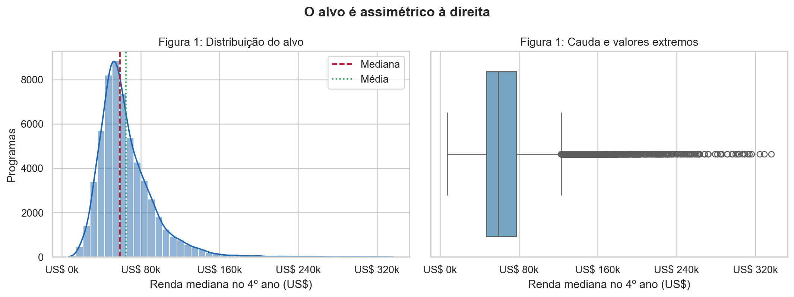

O alvo é assimétrico à direita: tem muitos valores
extremos altos e a média (US$ 64.887) fica acima da mediana (US$ 59.011).
Na futura rede, vale comparar a escala original com `log1p(y)`,
reportando o erro final também em dólares, para manter a interpretação.

> O *skew* de **1,755** acima usa as 58.063 linhas domésticas inteiras.
> Na tabela da seção 2‑A, calculada só com o treino (46.323 linhas), o
> mesmo alvo aparece com skew **1,689**: os dois valores estão certos,
> apenas descrevem populações ligeiramente diferentes.

### D. Treino e teste

Divide-se a base de dados com `GroupShuffleSplit(test_size=0.20, random_state=42)`,
agrupando por `opeid6` (a instituição). Isso evita que a mesma instituição
apareça dos dois lados do split, um critério mais rígido que sortear linha
por linha, porque instituições repetem muitos atributos entre seus próprios
cursos.

--8<-- "docs/projects/eda/tables/split_target_summary.md"

As medianas diferem em apenas **US$ 568 (0,96%)**, sinal de que o alvo ficou
equilibrado mesmo sem estratificação. Como o alvo é contínuo, prioriza-se o
bloqueio por instituição para evitar vazamento entre grupos. Um split
temporal não se aplica: o arquivo é um retrato transversal e não possui uma
data de observação por linha. Há **0 instituições em comum** entre treino e
teste.

A partir daqui, toda estatística de imputação, todo limite de outlier, toda
escala e todo agrupamento de categoria rara é aprendido **só no treino** e
depois aplicado ao teste.

## 2. Análise univariada

### A. Numéricas

Contagem, ausência, média, mediana, desvio, quartis, extremos e assimetria
de cada numérica mantida e do alvo, sempre calculados no treino:

--8<-- "docs/projects/eda/tables/numeric_summary_train.md"

Para manter uma única figura legível, seleciona-se o alvo e 11 preditoras
que representam todos os blocos do problema: renda anterior, dívida, custo,
seletividade e tamanho institucional, escala do programa, salário,
crescimento e vagas no mercado de trabalho e exposição à IA. A escolha
busca diversidade de domínio, escala e formato e não apenas as maiores
correlações com o alvo. As 27 distribuições continuam cobertas pela tabela
acima.

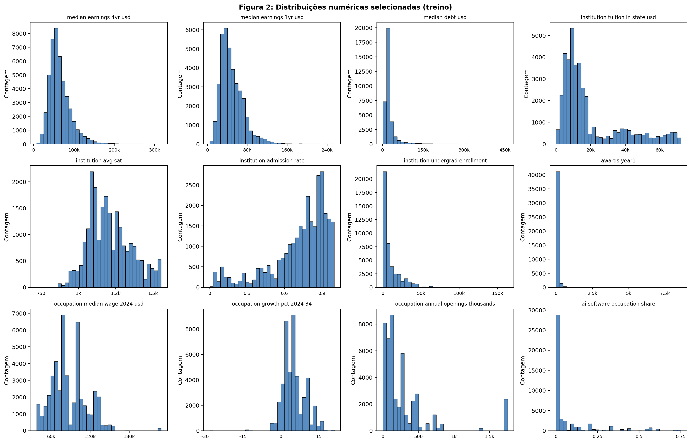

As escalas e os formatos variam muito de coluna
para coluna:

- As três flags binárias (`is_main_campus`, `institution_is_hbcu` e
  `outcomes_shared_across_campuses`) são proporções de 0/1 e sua *skewness*
  não deve ser interpretada como formato de uma variável contínua.
- SAT (*skew* 0,438) e crescimento ocupacional (0,460) são aproximadamente
  simétricos. Latitude, longitude, tuition out-of-state, crescimento máximo
  e salário ocupacional têm assimetria moderada (`0,5 ≤ |skew| < 1`).
- A taxa de admissão tem assimetria negativa forte (−1,282): a massa fica
  perto das taxas altas e a cauda aponta para instituições mais seletivas.
- As 16 numéricas restantes têm cauda forte à direita: alvo, renda anterior,
  matrículas, tuition in-state, diplomas nos dois anos, tamanho da coorte,
  dívida e número de mutuários, contagem e emprego das ocupações, vagas
  anuais e os quatro indicadores de IA.
- `awards_year1` chega a 8.584 contra uma mediana de 33 e `institution_undergrad_enrollment` chega a 163.164 contra uma mediana de 5.011,5.
- Os indicadores de IA são também zero-inflados: suas medianas são zero ou
  próximas de zero, embora apresentem caudas positivas longas.

Isso sustenta a escolha de winsorização (clipping) e padronização, as duas
aprendidas só no treino (seção 4‑A).

### B. Categóricas

--8<-- "docs/projects/eda/tables/categorical_summary_train.md"

A [tabela completa de frequências](tables/categorical_frequencies_train.md)
lista as 558 combinações variável–categoria, incluindo `(Ausente)`, com
contagem e percentual sobre as 46.323 linhas do treino. O marcador de rara
usa menos de 20 ocorrências, o mesmo limite usado depois pelo
`OneHotEncoder`.

- `cip_title` (o curso) tem **350 categorias** no treino; **142** delas
  aparecem menos de 20 vezes.
- `largest_linked_occupation` tem 127 categorias, 32 raras.
- Entre os valores observados, a ocupação mais comum é "Managers, all other"
  (13,06%), um rótulo genérico que limita o quanto dá para interpretar essa
  coluna. Na tabela completa, o percentual usa todas as linhas, inclusive
  as 1,45% sem ocupação.
- As demais categóricas têm cardinalidade baixa a moderada.

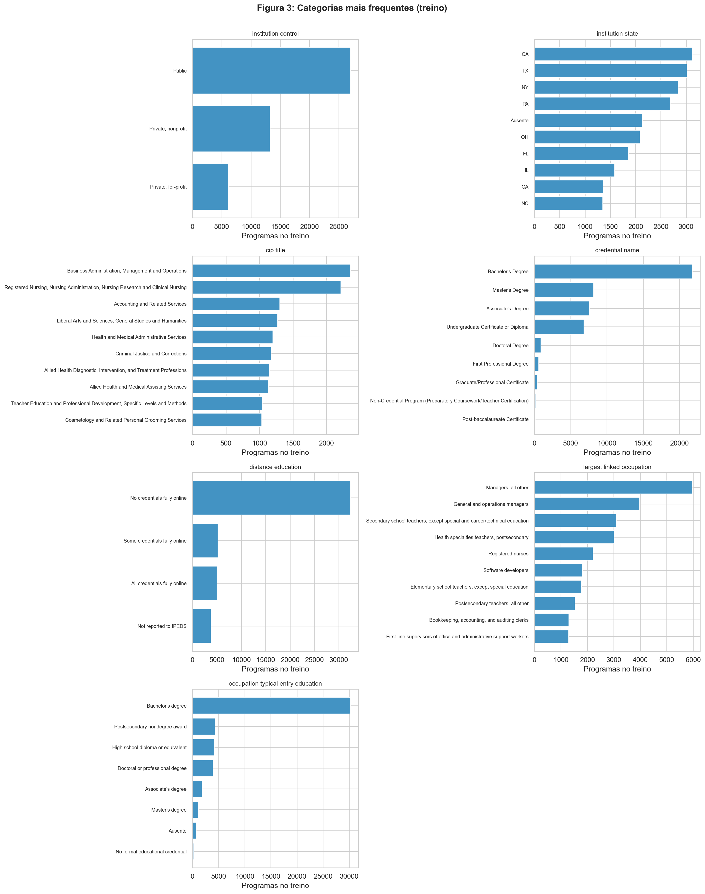

Instituições públicas, bacharelados e cursos
presenciais dominam o dataset. `cip_title` (curso) e `largest_linked_occupation`
(ocupação) têm cauda longa: poucas categorias grandes e muitas pequenas.
Por isso o one-hot encoding (seção 4‑A) agrupa as categorias raras em um
grupo "outras", em vez de criar milhares de colunas frágeis.

## 3. Análise bivariada e multivariada

### A. Numérica × numérica

Usamos correlação de **Spearman**, mais robusta que Pearson às caudas longas, outliers e relações não necessariamente lineares vistas na Figura 2. Matriz completa: [tabela em Markdown](tables/spearman_correlation_train.md).

- Par mais redundante entre features: emprego total da ocupação × vagas anuais abertas, **ρ = 0,976**.
- Maiores correlações com o alvo: renda no 1º ano (**ρ = 0,887**), salário mediano da ocupação (0,469), dívida mediana (0,404), mensalidade out-of-state (0,398) e tecnologias emergentes (0,339).

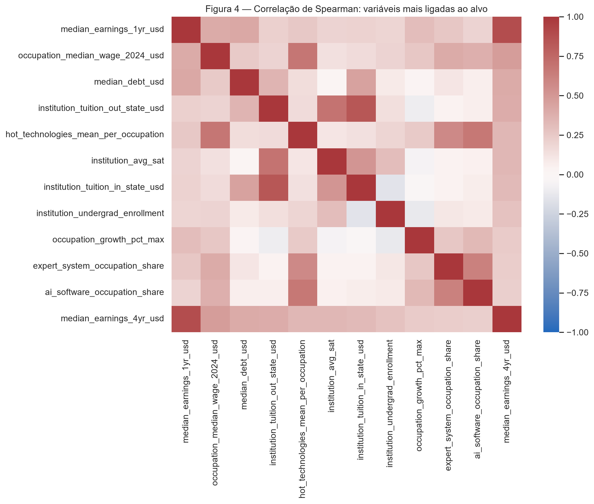

O sinal mais forte vem de um resultado financeiro anterior (renda de 1 ano), não de atributos estruturais do curso. Como emprego e vagas de uma ocupação são quase a mesma informação (ρ = 0,976), vale usar regularização na rede e uma análise de ablação, sem remover essa redundância às cegas, já que ainda pode carregar informação útil.

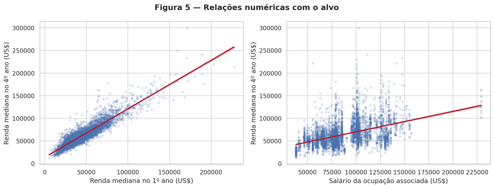

A renda do 1º ano segue uma relação quase linear com o alvo. Já o salário da ocupação sobe junto, mas de forma mais dispersa
e em faixas verticais, porque o mesmo número do BLS se repete em muitos programas ligados à mesma ocupação.

### B. Categórica × alvo

Para cobrir as sete categóricas que entram no modelo, a tabela abaixo
compara os extremos das medianas do alvo. Categorias com menos de 20
programas ficam fora dos extremos para que um grupo isolado não determine a
conclusão; `(Ausente)` é mantido como grupo descritivo.

--8<-- "docs/projects/eda/tables/categorical_target_summary_train.md"

As amplitudes mostram que todas as sete variáveis se relacionam com o alvo,
mas não devem ser comparadas como medida de importância: variáveis com 350
níveis, como `cip_title`, têm mais oportunidade de produzir extremos do que
variáveis com três ou quatro níveis. São associações descritivas, não
efeitos causais.

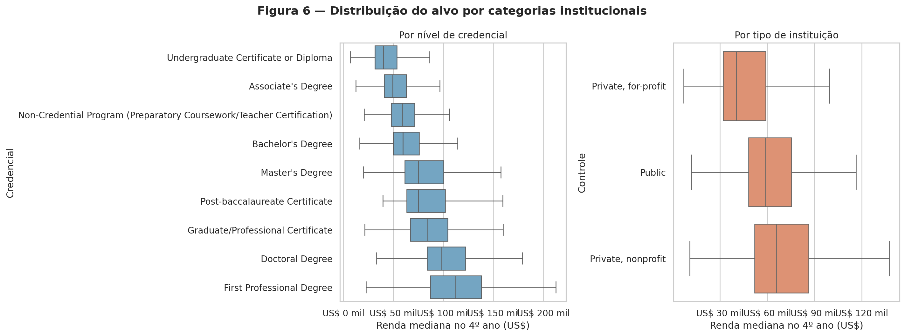

A posição do alvo muda bastante entre grupos:

| Credencial | Mediana |
|---|---:|
| Certificado de graduação (mais baixo) | US$ 39.665 |
| Primeiro diploma profissional (mais alto) | US$ 112.207 |

| Controle institucional | Mediana |
|---|---:|
| Privada sem fins lucrativos | US$ 65.951 |
| Pública | US$ 58.592 |
| Privada com fins lucrativos | US$ 40.451 |

Essas são associações descritivas: a composição de cursos e a seleção de
estudantes de cada grupo impedem uma leitura causal.

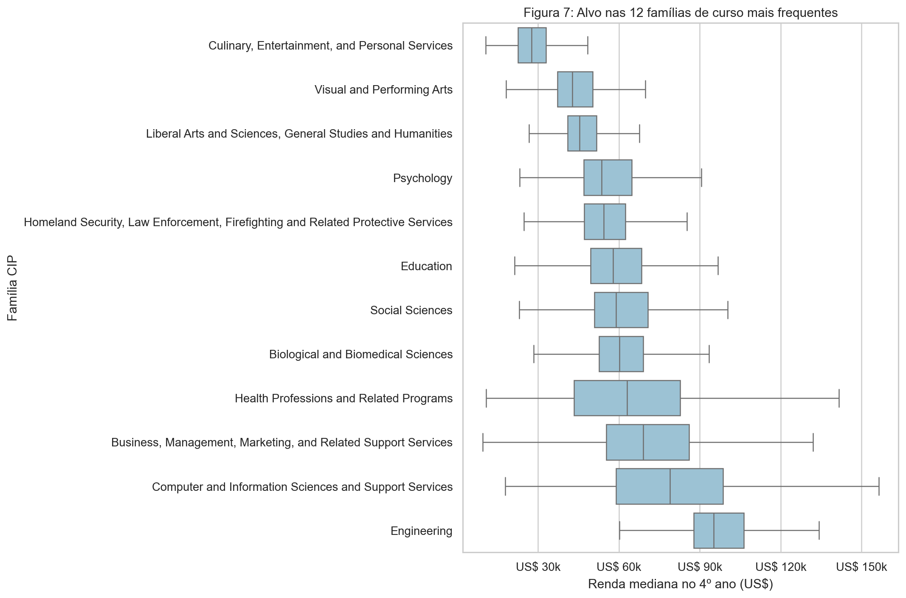

Entre as famílias mais frequentes, Engenharia
lidera com mediana de **US$ 95.085**, seguida por Computação (**US$
78.969**). Artes, serviços pessoais e humanidades ficam nas posições mais
baixas. O campo de estudo é uma fonte forte de variação e deve continuar no
modelo, com as categorias raras agrupadas. `cip_family_title` é usado aqui
somente para tornar a figura legível; a feature efetiva, `cip_title`, está
coberta na tabela compacta acima.

### C. Numérica × categórica

Escolhemos os dois pares por relevância substantiva, baixa cardinalidade
para leitura e capacidade de mostrar posição e dispersão no mesmo gráfico.
Tuition × controle institucional compara diretamente regimes de preço;
salário ocupacional × credencial conecta formação ao mercado de trabalho
sem repetir a relação categórica × alvo da seção anterior. Os boxplots usam
todo o treino, não uma amostra.

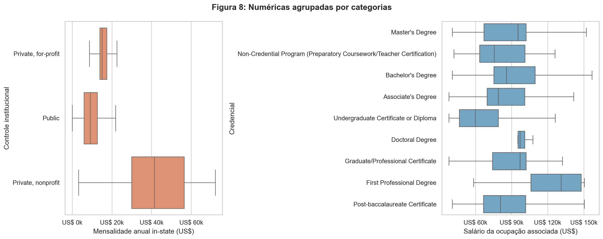

Instituições privadas sem fins lucrativos cobram
mensalidade mediana de **US$ 42.050** (IQR US$ 30.480–57.056), acima das
privadas com fins lucrativos (**US$ 15.120**) e das públicas (**US$ 9.186**;
IQR US$ 5.997–12.762), além de serem mais dispersas. O salário da ocupação
associada também muda de posição: a mediana vai de **US$ 59.810** nos
certificados de graduação a **US$ 134.830** no primeiro diploma
profissional. Logo, os grupos diferem em posição e dispersão. Padronizar as
escalas é necessário, mas não apaga essas diferenças estruturais: o modelo
ainda vai "ver" essa variação.

## 4. Pré-processamento

### A. Estratégias

Cada escolha responde a um achado da análise acima:

| Estratégia | O que faz | Achado que motiva | Resultado |
|---|---|---|---|
| **Faltantes** | Numéricas recebem a mediana do treino + um indicador binário de "estava ausente"; categóricas recebem a moda do treino | A ausência não é aleatória (seção 1‑B); o indicador preserva esse sinal em vez de escondê‑lo | O alvo ausente **não** é imputado: essas linhas simplesmente não entram na aprendizagem supervisionada |
| **Outliers** | Cada numérica com IQR positivo é "winsorizada" (cortada) nos limites Q1 − 1,5×IQR e Q3 + 1,5×IQR, aprendidos no treino | Caudas longas e valores extremos na Figura 2 (ex.: `awards_year1` chegando a 8.584) | Afeta ao menos uma feature em **26.006 linhas (56,14%)** do treino; nenhuma linha é removida. Flags/variáveis zero-infladas (IQR = 0) ficam intocadas |
| **Categóricas** | `OneHotEncoder(min_frequency=20, handle_unknown="infrequent_if_exist")` | Cauda longa em `cip_title` e `largest_linked_occupation` (Figura 3) | Categorias raras viram um grupo "outras"; uma categoria nunca vista no teste não quebra o pipeline |
| **Escala** | `StandardScaler`, ajustado depois do clipping e da imputação | As numéricas variam de proporções 0–1 a centenas de milhares de dólares/alunos (Figura 2) | Necessário porque a futura rede neural é sensível à escala das entradas |

### B. Redução de dimensionalidade

As três projeções usam a mesma amostra reproduzível de 3.000 linhas do
treino já pré-processado. A cor mostra o alvo só para leitura visual: ele
não entra em nenhum dos três algoritmos.

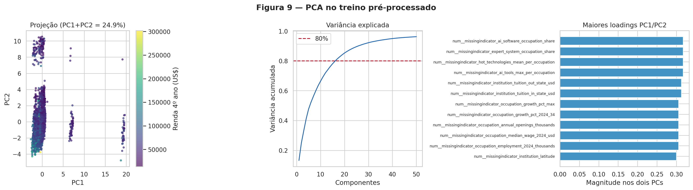

PC1 + PC2 explicam só **24,92%** da variância:
pouco. Os loadings mais fortes vêm de indicadores de ausência (ocupação,
IA, mensalidade), não das variáveis originais: isso quer dizer que o
**padrão de quais dados faltam** organiza o espaço tanto quanto os valores
em si. Em 2D, a PCA não separa o alvo de forma limpa.

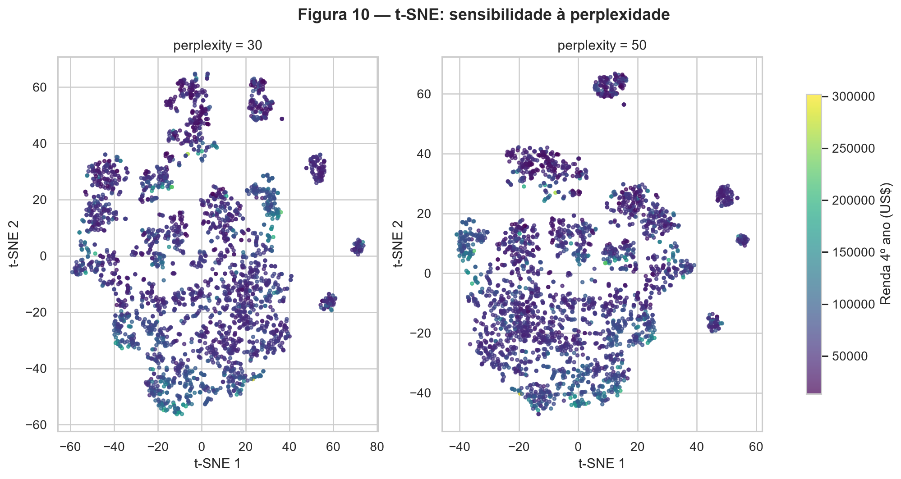

O t-SNE revela "ilhas" locais que a PCA linear
não mostra, mas o desenho muda visivelmente entre perplexidade 30 e 50, e as
cores ainda se misturam. Tamanho dos grupos e distância entre ilhas não
representam frequência real nem distância global; é só para diagnóstico.

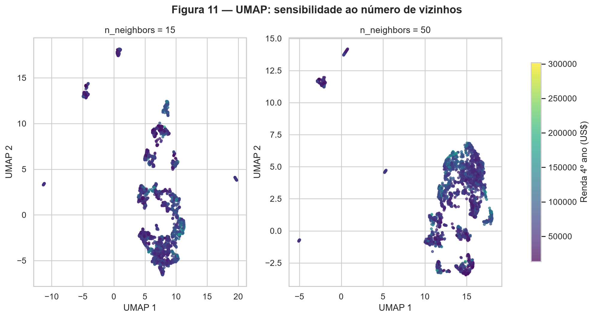

O UMAP também mostra componentes desconectados,
ligados a combinações de categorias e padrões de ausência. Mudar de 15 para
50 vizinhos altera a geometria, mas em nenhum dos dois casos aparece uma
fronteira simples de renda; de novo, distâncias entre grupos não têm
interpretação direta.

**Em conjunto:** t-SNE e UMAP mostram estrutura local não linear que a PCA
esconde, mas isso não significa que as "ilhas" sejam clusters reais de
alunos parecidos. Para a regressão, essas projeções servem só de
diagnóstico: a rede vai receber a matriz pré-processada completa, não os 2
componentes.

### C. Pipeline

O pré-processador é um `Pipeline` + `ColumnTransformer`, ajustado **só no treino**, implementado em [`pipeline.py`](code/pipeline.py) (importável, sem efeitos colaterais). Depois de transformar treino e teste:

| Checagem | Resultado |
|---|---|
| Shape do treino | (46.323, 431) |
| Shape do teste | (11.740, 431) |
| `NaN` nas duas matrizes | 0 |
| Categoria nunca vista no teste | tratada sem erro, mesma largura final |
| Nomes das 431 colunas finais | [pipeline_feature_names.md](tables/pipeline_feature_names.md) |

O script que reproduz split, tabelas, figuras, projeções e essas checagens
está em [`analysis.py`](code/analysis.py); rode com
`python docs/projects/eda/code/analysis.py` a partir da raiz do repositório.

## 5. Síntese

**Principais achados:**

- A renda de 4 anos é assimétrica à direita (Figura 1; skew 1,755). A
  futura modelagem deve comparar o alvo original com `log1p(y)`, sem
  esconder o erro absoluto em dólares.
- A renda do 1º ano é o sinal numérico mais forte (Figura 5; ρ = 0,887),
  mas falta em 18,23% do treino. Uma versão do modelo sem essa variável vai
  medir o quanto o resultado depende de um número financeiro que já existe
  antes do alvo.
- Curso, credencial e controle institucional deslocam a posição e a
  dispersão do alvo (Figuras 6–8): encoding de categorias raras e
  regularização vão ser essenciais.
- PC1 + PC2 retêm só 24,92% da variância, e as projeções não lineares
  mostram estrutura instável (Figuras 9–11). Não há motivo para reduzir a
  entrada da rede a duas dimensões.

**Riscos para a modelagem e como tratar cada um:**

| Risco | Plano de tratamento |
|---|---|
| **Viés de seleção**: 74,51% dos alvos foram suprimidos | Descrever o domínio do modelo como "programas com turma grande o bastante para divulgar renda", e comparar o perfil de quem tem e não tem alvo |
| **Vazamento de dados** | Manter a lista de exclusão da seção 1‑B e o split agrupado por instituição |
| **Cauda longa e outliers no alvo** | Clipping só nas features (nunca no alvo), comparar `log1p(y)`, reportar MAE/RMSE |
| **Categorias novas fora do treino** | Agrupamento de categorias raras + `handle_unknown="infrequent_if_exist"` |
| **Medidas ocupacionais nacionais repetidas entre programas** | Evitar leitura causal; validar erro do modelo separado por curso, credencial e controle institucional |

**Resumo dos 10 resultados pedidos:**

| # | Resumo dos resultados | Valor |
|---:|---|---|
| 1 | Dataset, tarefa e alvo | College Majors 2026; regressão; `median_earnings_4yr_usd` |
| 2 | Instâncias × features (numéricas / categóricas) | 227.980 × 72 no bruto; 58.063 linhas modeláveis; 33 features (26 / 7) |
| 3 | Coluna com mais ausentes e percentual | `pct_working_in_state_5yr`: 188.983 (82,90%) |
| 4 | Colunas descartadas e motivo | 37 colunas excluídas como preditoras: identificadores, redundâncias, vazamento do alvo, informação futura, fórmulas derivadas, indicadores de disponibilidade e texto livre; `opeid6` fica reservado ao split (seção 1‑B) |
| 5 | Média e mediana do alvo | US$ 64.887 e US$ 59.011 |
| 6 | Tamanho de treino e teste | 46.323 e 11.740 programas; 0 instituições em comum |
| 7 | Par numérico mais correlacionado | emprego da ocupação × aberturas anuais: Spearman ρ = 0,976 |
| 8 | Linhas afetadas pela estratégia de outlier | 26.006 no treino (56,14%); winsorizadas, nenhuma removida |
| 9 | Variância explicada por PC1 + PC2 | 24,92% |
| 10 | `shape` após o pipeline | treino (46.323, 431); teste (11.740, 431); 0 `NaN` |
